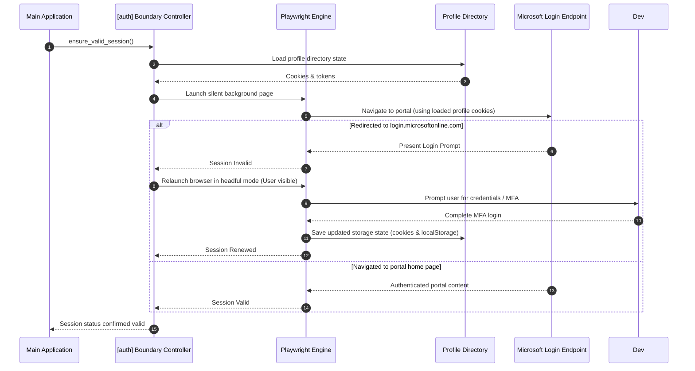
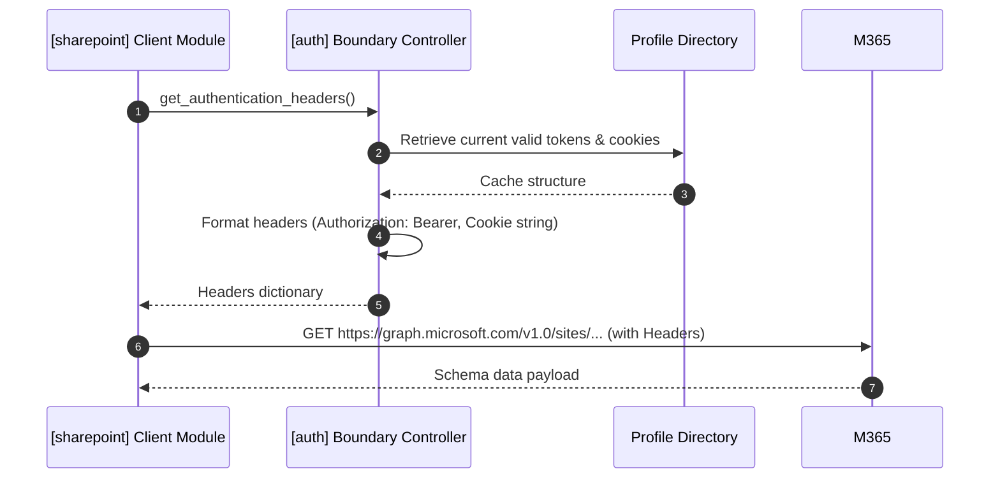

# Authentication Architecture Specification: PowerFlow Architect

## 1. Purpose

The purpose of the **PowerFlow Architect Authentication Module** is to provide a reliable, unified, and secure authentication layer that enables programmatic operations against Microsoft SharePoint Online and Power Automate endpoints. To bypass complex multi-factor authentication (MFA) and conditional access policies that block direct API client credentials in strict enterprise environments, this module leverages **Playwright** browser automation. It maintains, reuses, and shares a persistent browser state to authenticate session contexts.

## 2. Scope

### 2.1 In-Scope
* **Persistent Session Reuse**: Mechanics for loading, saving, and managing a persistent Playwright browser profile directory containing session state (cookies, localStorage, and tokens).
* **Unified Authentication Interface**: A simplified boundary interface exposed to the rest of the application that yields headers, cookies, and HTTP clients.
* **Interactive Authentication Fallback**: Triggering a visual browser context for user login when sessions expire, are revoked, or are missing.
* **Request Decoration Services**: Standardized decoration of API requests with cookies and bearer tokens extracted from the Playwright browser context.

### 2.2 Out-of-Scope
* **Custom Credential Vaulting**: Storing raw passwords or user secrets locally (handled by the browser profile or OS-level credential managers).
* **Enterprise Identity Management**: Authenticating user identities outside of Microsoft Entra ID (Azure AD).

## 3. Background

Automating enterprise tasks in Microsoft 365 environments via backend scripts is challenging due to security policies:
1. **Interactive MFA (Multi-Factor Authentication)**: Service accounts often require secondary approval codes (SMS, Authenticator App, FIDO keys) which standard API calls cannot handle.
2. **Conditional Access Policies**: Rules that restrict API tokens unless requests originate from managed devices or specific browsers.

Instead of registering complex Azure AD App Registrations that require global admin permissions, PowerFlow Architect uses browser-based authentication. By launching a real browser instance via Playwright and sharing the browser's profile directory (containing standard session cookies), the tool acts as a standard authenticated user. This eliminates MFA setup for scripts while allowing secure M365 API automation.

---

## 4. Functional Requirements

### 4.1 Session Persistent Directory Management
* The module **shall** initialize a dedicated persistent user data directory (profile folder) for browser operations.
* The module **shall** check for existing session files (cookies, localStorage, token caches) in the profile folder upon startup.

### 4.2 Automated & Interactive Authentication Flow
* The module **shall** perform a silent validation check by loading a silent background browser page and navigating to a target Microsoft URL.
* If redirected to a login prompt, the system **shall** launch an interactive browser window to allow the user to complete MFA.
* The system **shall** save the updated browser state automatically upon successful navigation to the post-auth landing page.

### 4.3 Client Session Extraction & Interface
* The module **shall** expose a simple interface to return the active authentication state to calling modules (e.g., SharePoint and Power Automate clients).
* The interface **shall** provide:
  * **Header Decorator**: Translates browser cookie jars into format-compatible HTTP headers.
  * **Bearer Token Resolver**: Extracts active access tokens from headers captured during background network validation calls.

---

## 5. Non-functional Requirements

### 5.1 Encapsulation (SOLID Boundary)
* Calling modules **shall not** depend on Playwright. The authentication module must completely encapsulate all Playwright dependencies.
* The external interface must return raw native dictionaries (e.g., header maps) or standardized HTTP request objects.

### 5.2 Stability & Timeout Thresholds
* Silent validation checks **shall** timeout after a maximum of 15 seconds, gracefully falling back to interactive prompts.
* Interactive login windows **shall** remain open for up to 300 seconds to allow the user sufficient time to complete MFA.

### 5.3 Storage Portability
* The profile directory **shall** be path-configurable, allowing execution environments to store session data in centralized cache directories.

---

## 6. Assumptions

* **M365 Portal Accessibility**: The host environment has network access to standard Microsoft login portals (`login.microsoftonline.com`, `make.powerautomate.com`).
* **Active User Profile**: An initial interactive login has been executed to generate the baseline profile state.
* **Persistent Session Lifespans**: Microsoft session cookies are configured with reasonable lifetimes (e.g., "Keep me signed in" flag active) to allow silent reuse for multiple days.

## 7. Constraints

* **Headless Browser Limits**: Headless browser automation may be flagged by anti-bot heuristics (e.g., Cloudflare, Entra ID Risk Policies). The module must default to headful validation checks if headless login is blocked.
* **Write Permissions**: The host environment must have file system write access to the configured profile directory.

---

## 8. Architecture

The authentication architecture is divided into the private automation layer and the public client interface layer. Calling modules interact solely with the public interface, maintaining strict decoupling.

```
+-----------------------------------------------------------------------------------+
|                              Sharepoint / PowerAutomate                           |
+-----------------------------------------------------------------------------------+
                                         |
                                         | requests authentication data
                                         v
+-----------------------------------------------------------------------------------+
|                        [auth] Public Interface Boundary                           |
+-----------------------------------------------------------------------------------+
                                         |
                       +-----------------+-----------------+
                       |                                   |
                       v                                   v
+---------------------------------------------+ +-----------------------------------+
|        Playwright Context Manager           | |       Session Data Parser         |
|  - Manages Persistent Profiles              | |  - Extracts HTTP Headers          |
|  - Triggers Interactive / Silent Pages      | |  - Formats Authorization Tokens   |
+---------------------------------------------+ +-----------------------------------+
                       |
                       v
+---------------------------------------------+
|          Filesystem Profile Storage         |
+---------------------------------------------+
```

## 9. Components

### 9.1 Session Boundary Controller (Interface)
* **Responsibility**: Exposes abstract methods to other modules.
* **Exposed Methods**:
  * `ensure_valid_session()`: Checks validation, prompts user if invalid.
  * `get_authentication_headers()`: Returns authorization header maps and cookies.
  * `get_session_cookies()`: Returns cookies for native HTTP client engines.

### 9.2 Playwright Automation Engine
* **Responsibility**: Wraps Playwright browser context instances.
* **Details**: Handles launching of browser profiles, headless vs headful mode controls, and detects redirects to login portals.

### 9.3 State Parser & Extractor
* **Responsibility**: Ingests browser network calls, intercepts authorization headers, and serializes cookies.
* **Details**: Listens to request events on validation checks. If it detects a request containing an active `Authorization: Bearer <token>`, it extracts and caches the token for API usage.

---

## 10. Data Flow

### 10.1 Initialization & Silent Validation Flow
This sequence demonstrates how the system validates an existing session silently, only prompting the user when expired.



### 10.2 API Client Authentication Flow
This diagram details how another module obtains and applies authentication details to interact with SharePoint.



---

## 11. Error Handling

* **User Authentication Cancellation**: If the user closes the interactive login window prior to completing MFA, the module must raise an `AuthenticationCancelledError`.
* **Corrupt Profile Directory**: If the profile state is corrupt, the parser must purge the directory, trigger a fresh interactive login, and rebuild the profile.
* **API Expiration during operation**: In the event that a call returns HTTP 401 (Unauthorized) during execution, the client calling module must request `ensure_valid_session()` with a force-renew flag to trigger token updates.

## 12. Security Considerations

* **Decryption Scope**: Raw cookie files are stored within the OS-managed user profile. Permissions to the profile directory **shall** be restricted using OS file permissions (`0700` or Owner-only read-write) to prevent cross-user token theft.
* **Token Lifetime Validation**: The module **shall** actively check the `exp` claim on extracted JWT tokens (when accessible) to determine expiration prior to making network requests.

## 13. Configuration

```yaml
authentication:
  profile_directory: "./playwright-profile"
  validation_url: "https://make.powerautomate.com"
  headless_validation: true
  login_timeout_seconds: 300
```

## 14. Testing Considerations

### 14.1 Mock Verification
* Calling modules **shall** be tested using a Mock Authentication Boundary that returns dummy headers (e.g. `{"Authorization": "Bearer mock-token"}`), verifying that callers parse and apply headers correctly.

### 14.2 Session Renewal Testing
* Unit tests **shall** mock redirect logic to verify that the validation engine correctly transitions from silent mode to interactive mode when redirects are detected.

## 15. Future Enhancements

* **Secure Token Encapsulation**: Storing extracted access tokens in OS keychains (Credential Vault on Windows, Keychain on macOS) rather than plain-text JSON caches on disk.
* **Headless MFA Alerts**: Integrating push notifications (via Slack/Teams webhooks) to alert developers when a background headless runner requires an interactive login refresh.

## 16. Open Questions

1. **Profile Sharing**: Can the same profile directory be safely accessed concurrently by multiple parallel processes, or does Playwright enforce a file lock on the user directory? (Typically, Playwright locks the user data directory, indicating that sequential execution or independent profile directories are required).
2. **Session Persistence Boundaries**: How frequently do Microsoft tenant configurations enforce session revocations (e.g., maximum token age limits of 24 hours vs 14 days)? This determines how often manual user intervention is needed.
