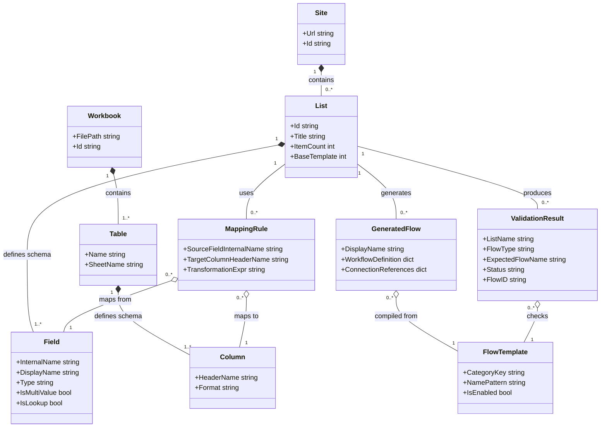
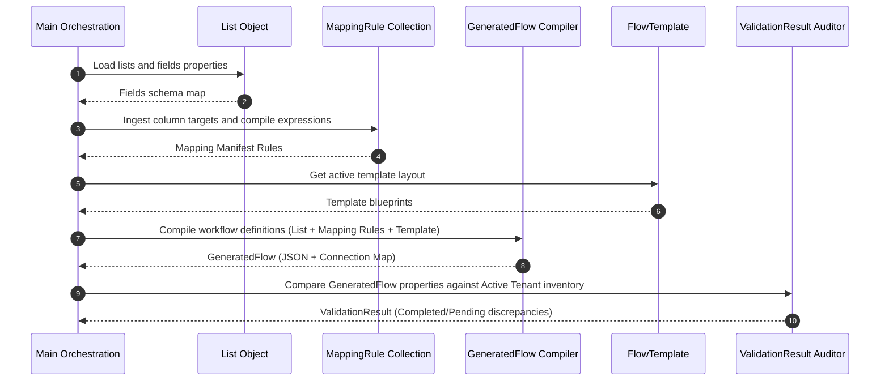

# Domain Model Specification: PowerFlow Architect

## 1. Purpose

The purpose of this document is to define the core domain entities of the **PowerFlow Architect** framework. By modeling these entities at a high level of abstraction, this specification ensures that the domain logic remains independent of specific implementation details, database types, API layers, or programming language constructs. This domain model serves as the single source of truth for terms and relationships across the entire application workspace.

## 2. Scope

### 2.1 In-Scope
* **Entity Definitions**: High-level semantic models for all core components (SharePoint structures, Excel structures, templates, mapping rules, generated output artifacts, and validation audits).
* **Structural Relationships**: Cardinality and structural associations between entities.
* **Property Mappings**: Core attributes necessary to define schemas, mapping rules, and execution outcomes.

### 2.2 Out-of-Scope
* **Database Schemas**: Concrete table configurations or SQL definitions.
* **API Payloads**: Exact HTTP requests or response serialization JSONs for Graph, SharePoint, or Power Automate.

## 3. Background

PowerFlow Architect translates data structures between two distinct Microsoft storage frameworks (SharePoint Lists and Excel Tables) and generates operational assets (Power Automate flows) to synchronize them. Defining a consistent domain model is critical to establishing a shared language (Ubiquitous Language) for platform developers. This model decouples data-ingestion clients from template generators, allowing developers to add new features without violating SOLID principles.

---

## 4. Domain Entities

The core entities of the domain model are specified below:

### 4.1 SharePoint Metamodel Entities

#### Entity: Site
* **Description**: Represents a SharePoint site collection or subsite containing lists and document libraries.
* **Attributes**:
  * `Url`: Absolute logical location of the site.
  * `Id`: Unique system identifier (GUID) resolved from Entra ID.

#### Entity: List
* **Description**: A collection of structured records (rows) in SharePoint.
* **Attributes**:
  * `Id`: Unique system identifier (GUID) of the list.
  * `Title`: System name of the list used in API references.
  * `ItemCount`: Total quantity of active records.
  * `BaseTemplate`: SharePoint list template indicator (e.g. 101 for Document Library, 100 for Generic List).

#### Entity: Field
* **Description**: A schema column defining a data type and constraints inside a List.
* **Attributes**:
  * `InternalName`: Persistent system identifier of the field (immutable after creation).
  * `DisplayName`: Human-readable label displayed in the SharePoint UI (mutable).
  * `Type`: Semantic classification of the field (e.g. Text, Note, Choice, DateTime, Number, Lookup, User).
  * `IsMultiValue`: Boolean flag indicating if the field holds an array collection of items.
  * `IsLookup`: Boolean flag indicating if this field retrieves its values from another target list.

---

### 4.2 Excel Metamodel Entities

#### Entity: Workbook
* **Description**: A target Microsoft Excel spreadsheet file stored in a cloud drive or local path.
* **Attributes**:
  * `FilePath`: Logical route or cloud reference pointer to the workbook file.
  * `Id`: Unique system identifier when hosted in SharePoint or OneDrive.

#### Entity: Table
* **Description**: A designated tabular data region containing named rows and columns within a workbook worksheet.
* **Attributes**:
  * `Name`: Unique table name reference (used in Power Automate operations).
  * `SheetName`: The sheet tab containing the target table.

#### Entity: Column
* **Description**: A single data field header within an Excel Table.
* **Attributes**:
  * `HeaderName`: The title text of the column header (acts as primary mapping reference).
  * `Format`: Explicit formatting constraints (e.g. Text, General, Currency, Short Date).

---

### 4.3 Mapping & Generation Entities

#### Entity: FlowTemplate
* **Description**: An abstract schema definition describing a Power Automate flow pattern (e.g. "Sync Add and Update", "Scheduled Validation") containing structural placeholders.
* **Attributes**:
  * `CategoryKey`: Standard template identifier (e.g. `delete`, `scheduled_validation`, `manual_full_rebuild`).
  * `NamePattern`: Template string used to compile expected names (e.g., `"{list} - Scheduled Validation"`).
  * `IsEnabled`: Boolean flag to determine if this template category is active.

#### Entity: MappingRule
* **Description**: A configuration rule linking a SharePoint Field directly to an Excel Column, defining transformation actions.
* **Attributes**:
  * `SourceFieldInternalName`: References the origin SharePoint list column.
  * `TargetColumnHeaderName`: References the target Excel column name.
  * `TransformationExpr`: The compiled Power Automate expression needed to format the output value.

#### Entity: GeneratedFlow
* **Description**: The compiled output artifact consisting of flow definition JSON and connection maps ready to be packaged or deployed.
* **Attributes**:
  * `DisplayName`: The concrete compiled name of the flow.
  * `WorkflowDefinition`: Conforming JSON payload describing triggers, actions, and limits.
  * `ConnectionReferences`: Map of external API resource connections utilized by the flow.

---

### 4.4 Audit & Assessment Entities

#### Entity: ValidationResult
* **Description**: The audited outcome of comparing expected system designs against active tenant resource realities.
* **Attributes**:
  * `ListName`: The target SharePoint list audited.
  * `FlowType`: The category evaluated (e.g., Delete Excel Row).
  * `ExpectedFlowName`: The name the flow *should* have.
  * `Status`: Classification state (e.g. `Completed`, `Pending`, `Non-Standard`).
  * `FlowID`: Active unique flow identifier in the Microsoft tenant (empty if Pending).

---

## 5. Domain Relationships

The following entity-relationship diagram illustrates how the core entities are associated with one another.



---

## 6. Data Flow: Generation Domain Interaction
The following diagram highlights how domain components interact to translate lists into validated flow configurations.



## 7. Configuration

```yaml
domain_mapping_rules:
  - source:
      site_url: "https://tenant.sharepoint.com/sites/Platform"
      list_title: "LIST_SystemInventory"
    target:
      excel_path: "/drives/inventory/SystemInventory.xlsx"
      table_name: "InventoryTable"
    rules:
      - source_field: "Title"
        target_column: "SystemName"
      - source_field: "Created"
        target_column: "CreationDate"
```

## 8. Open Questions

1. **Mapping Scope**: Should a `MappingRule` entity support composite field mappings (e.g. merging two SharePoint fields like `FirstName` and `LastName` into a single Excel column `FullName`)? (Supported conceptually in `TransformationExpr` expressions, but metadata configurations are assumed to be 1-to-1).
2. **Workbook Versioning**: Does a change to an Excel `Table` name invalidate all associated mappings, or does the generator fallback to matching columns by name in the first available table? (Assumed to require strict matching by `Table` name to prevent writing to incorrect spreadsheets).
