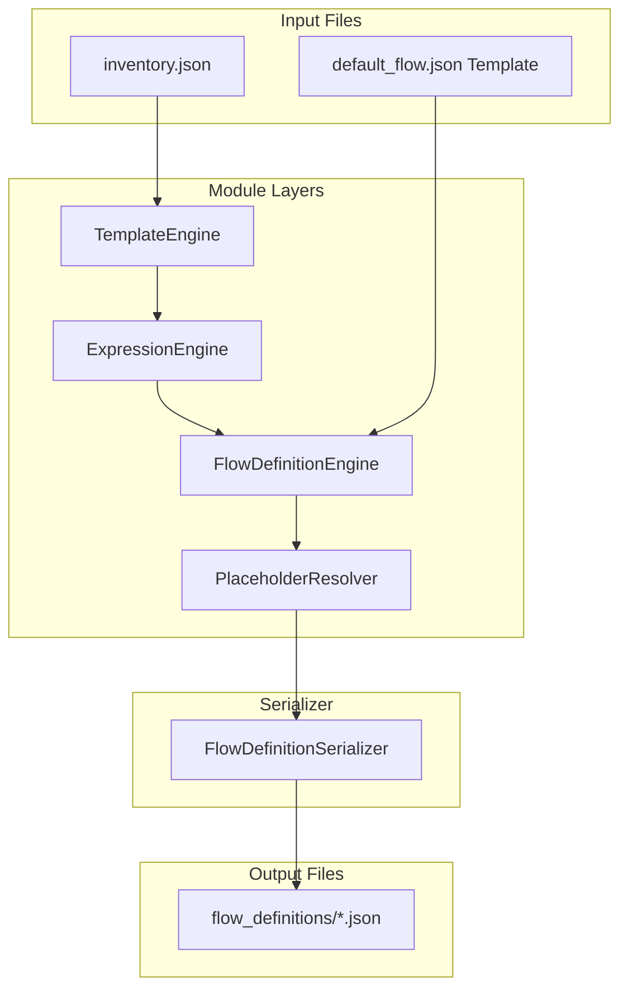

# Flow Definition Engine Architecture Documentation

This document describes the design, placeholders, data context, and serialization protocols of the Flow Definition Engine introduced in Sprint 5.

## Objective
The Flow Definition Engine compiles full, deploy-ready Power Automate flow definition JSON files from reusable flow templates. 

## Key Architecture & Design Choices



### 1. Reusable PowerFlow Architect Template Format
We establish a template configuration format (`templates/default_flow.json`) representing logicflow connections with standard variables. Key configurable variables are represented in the template using placeholder tags matching the pattern `${PLACEHOLDER}`:
- `${LIST_NAME}`: The target SharePoint list name/ID.
- `${EXCEL_FILE}`: The path/name of the target Excel spreadsheet.
- `${EXCEL_TABLE}`: The Excel table name inside the file.
- `${VALUE_OBJECT}`: The compiled JSON mapping object mapping display names to Power Automate expressions.
- `${TRIGGER_NAME}`: The internal trigger name of the logicflow.
- `${SITE_URL}`: The target SharePoint site web URL.

### 2. Isolated Placeholder Resolution
Placeholder replacements must happen exclusively inside `PlaceholderResolver.resolve()` in `placeholder_resolver.py`. No other module is permitted to perform string/placeholder replacements. The resolver:
- Serializes the Python `VALUE_OBJECT` dictionary block into a JSON string block and replaces `${VALUE_OBJECT}` directly.
- Performs text replacements for other standard string values.
- Asserts that all matching `${PLACEHOLDER}` occurrences have been successfully resolved. If any unresolved placeholder tags remain, it raises a `ValueError`.
- Validates the resulting string by attempting to load it as JSON. If the output is malformed, it raises a `ValueError`.

### 3. Clear Separation of Responsibilities
The Flow Definition Engine does not perform filtering of system columns or unsupported types. This responsibility belongs strictly to the Template Engine (Sprint 4) to prevent duplication of validation rules. The definition engine works on top of clean templates loaded from the Template Engine.

---

## Deliverables

All generated flow definitions are saved inside the `flow_definitions/` directory (ignored by git, but the folder itself is kept) as separate JSON files named after their respective lists:
```text
flow_definitions/
    LIST_SystemInventory.json
    REG_Risks.json
    REG_Actions.json
```
