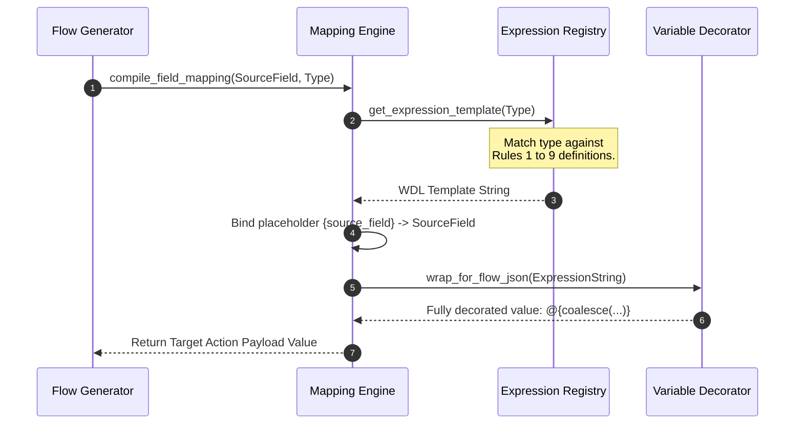
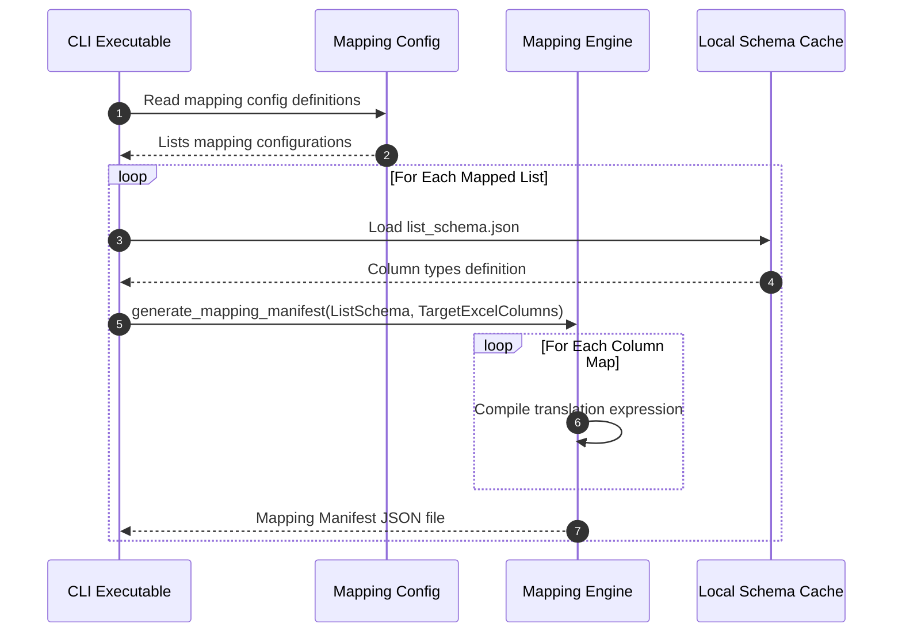

# Mapping Engine Specification: PowerFlow Architect

## 1. Purpose

The purpose of the **Mapping Engine** is to define and execute transformation rules that translate SharePoint list data structures into formats compatible with Excel tables. Because SharePoint columns (such as Lookup, Person/Group, Multi-Choice, and Formatted Date) do not map directly to simple Excel text or numerical columns, the Mapping Engine compiles logical **Power Automate expressions** to sanitize and format data dynamically during flow execution.

## 2. Scope

### 2.1 In-Scope
* **Type-to-Expression Rule Definitions**: Formal transformation maps converting SharePoint field types into Power Automate Workflow Definition Language (WDL) expressions.
* **Complex Data Extraction Rules**: Extraction logic for lookup lists, user emails, multi-choice items, and date formats.
* **Expression Template Engine**: A programmatic architecture that builds string-formatted expressions for inclusion in flow actions.
* **Null-Safety & Fallbacks**: Evaluation rules to handle missing, blank, or null SharePoint fields.

### 2.2 Out-of-Scope
* **Expression Evaluation Engine**: Evaluating or running expressions locally in Python. (The Python engine *generates* the expression string templates; Microsoft Power Automate *evaluates* them at runtime).
* **Direct UI Formula Editors**: A visual editor for Excel calculations.

## 3. Background

SharePoint data objects returned via Graph API or trigger bodies are highly nested JSON objects. For example, a User field is represented as:
```json
{
  "Claims": "i:0#.f|membership|user@tenant.onmicrosoft.com",
  "DisplayName": "User Name",
  "Email": "user@tenant.onmicrosoft.com",
  "Picture": "..."
}
```
If an Excel sheet requires the user's email, writing the raw field object will fail or insert serialized JSON. The flow must use a calculated expression:
`triggerBody()?['UserField']?['Email']`

The Mapping Engine acts as a compiler that takes mapping instructions (e.g. `UserField -> Email`) and automatically outputs the WDL expression strings required for the generated Flow JSON.

---

## 4. Functional Requirements: Transformation Rules

The Mapping Engine **shall** apply the following transformation rules when converting SharePoint column schemas into Power Automate expressions:

### Rule 1: Text & Note Fields (Strings)
* **Source Type**: Single line of text, Multiple lines of text.
* **Target Excel format**: Text.
* **Transformation Rule**: Apply null-safety syntax. If field is null, map to an empty string.
* **Expression Template**:
  ```text
  coalesce(triggerBody()?['{source_field}'], '')
  ```

### Rule 2: Choice Fields (Single Value)
* **Source Type**: Choice (Single value dropdown).
* **Target Excel format**: Text.
* **Transformation Rule**: Extract the inner `Value` property.
* **Expression Template**:
  ```text
  coalesce(triggerBody()?['{source_field}']?['Value'], '')
  ```

### Rule 3: Choice Fields (Multi-Value)
* **Source Type**: Choice (Allow multiple selections).
* **Target Excel format**: Text (delimited string, e.g., "Choice A; Choice B").
* **Transformation Rule**: Extract choice values from array collection and join them with a semicolon.
* **Expression Template**:
  ```text
  join(xpath(xml(json(concat('{"root":{"val":', string(coalesce(triggerBody()?['{source_field}'], json('[]'))), '}}'))), '/root/val/Value/text()'), '; ')
  ```

### Rule 4: Person or Group Fields (Single Value)
* **Source Type**: User/Group (Single selection).
* **Target Excel format**: Text (User Principal Name / Email).
* **Transformation Rule**: Extract the `Email` or `DisplayName` property.
* **Expression Template**:
  ```text
  coalesce(triggerBody()?['{source_field}']?['Email'], triggerBody()?['{source_field}']?['DisplayName'], '')
  ```

### Rule 5: Person or Group Fields (Multi-Value)
* **Source Type**: User/Group (Allow multiple selections).
* **Target Excel format**: Text (delimited emails, e.g., "user1@domain.com; user2@domain.com").
* **Transformation Rule**: Query the user collection array, project the `Email` elements, and join with a semicolon.
* **Expression Template**:
  ```text
  join(xpath(xml(json(concat('{"root":{"val":', string(coalesce(triggerBody()?['{source_field}'], json('[]'))), '}}'))), '/root/val/Email/text()'), '; ')
  ```

### Rule 6: Lookup Fields (Single Value)
* **Source Type**: Lookup to target list.
* **Target Excel format**: Text or Number.
* **Transformation Rule**: Extract lookup identifier or text value.
* **Expression Template**:
  ```text
  coalesce(triggerBody()?['{source_field}']?['Value'], '')
  ```

### Rule 7: Date and Time Fields
* **Source Type**: DateTime (Date Only or Date & Time).
* **Target Excel format**: Date (standardized ISO 8601 or Excel display format).
* **Transformation Rule**: Convert ISO timestamp to target format, applying UTC alignment.
* **Expression Template**:
  ```text
  if(equals(triggerBody()?['{source_field}'], null), '', formatDateTime(triggerBody()?['{source_field}'], 'yyyy-MM-dd HH:mm:ss'))
  ```

### Rule 8: Boolean Fields (Yes/No)
* **Source Type**: Boolean.
* **Target Excel format**: Text ("Yes" / "No") or logical integer (`1` / `0`).
* **Transformation Rule**: Evaluate truthiness value and return target indicator.
* **Expression Template**:
  ```text
  if(equals(triggerBody()?['{source_field}'], true), 'Yes', 'No')
  ```

### Rule 9: Number & Currency Fields
* **Source Type**: Integer, Float, Currency.
* **Target Excel format**: Decimal / Numeric.
* **Transformation Rule**: Convert null values to `0` or null representation to prevent arithmetic errors.
* **Expression Template**:
  ```text
  if(equals(triggerBody()?['{source_field}'], null), 0, triggerBody()?['{source_field}'])
  ```

---

## 5. Non-functional Requirements

### 5.1 No Hardcoded Fields
* The compiler logic **shall** inject column references dynamically using configuration-driven replacements. Expression strings must never contain hardcoded system field names.

### 5.2 Performance & Cache Reuse
* Compiled expression templates **shall** be cached in-memory during flow generation runs, ensuring identical column-type configurations do not re-trigger template parses.

---

## 6. Assumptions

* **Trigger Type Identification**: Generated expressions assume standard SharePoint trigger models (e.g., "When an item is created or modified" or "For a selected item") which populate the JSON namespace inside `triggerBody()`.
* **Delimiter Configuration**: A semicolon followed by a space (`; `) is assumed to be the standard multi-value delimiter for Excel table ingestion.

## 7. Constraints

* **WDL Function Limit**: WDL expressions are constrained to Microsoft standard library functions. Custom user-defined Python functions cannot run within Power Automate.
* **Excel Cell Character Limits**: Excel cells have a maximum length limit of 32,767 characters. Aggregated multi-value choice/user fields exceeding this limit must be handled gracefully to avoid truncating XML payload parsers.

---

## 8. Architecture

The Mapping Engine acts as a logical pipeline, transforming abstract field mappings into target flow expressions.

```
       +-----------------------+
       |   SharePoint Schema   |
       +-----------------------+
                   |
                   v
+--------------------------------------+
|            Mapping Engine            |
|                                      |
|  +--------------------------------+  |
|  |       Mapping Compiler         |  |
|  |  - Ingests config relationships |  |
|  +--------------------------------+  |
|                  |                   |
|                  v                   |
|  +--------------------------------+  |
|  |     Expression Registry        |  |
|  |  - Applies type-to-WDL templates|  |
|  +--------------------------------+  |
+--------------------------------------+
                   |
                   v
       +-----------------------+
       | Power Automate WDL    |
       | Action Payload JSON   |
       +-----------------------+
```

## 9. Components

### 9.1 Mapping Rules Compiler
* **Responsibility**: Ingests configuration specifications mapping list columns to Excel headings.

### 9.2 Expression Translation Registry
* **Responsibility**: Evaluates column types. Houses the rule definitions (Rules 1 to 9) and formats them into WDL string parameters.

### 9.3 Variable Decorator
* **Responsibility**: Inspects generated variables, wrapping statements in appropriate nesting characters (e.g., `@{...}`) required when generating flow action fields.

---

## 10. Data Flow

### 10.1 Expression Generation Pipeline
This workflow highlights how a list schema column is converted to an Excel-compatible update action expression.



### 10.2 Bulk Flow Compilation Data Flow
This diagram details the sequence when compiling mappings for an entire list schema configuration.



---

## 11. Error Handling

* **Unsupported Types**: If a SharePoint column type has no registered mapping translation rule, the engine **shall** issue a translation warning, generate a default text extraction expression (`coalesce(triggerBody()?['FieldName'], '')`), and proceed.
* **Variable Collision**: The engine **shall** validate that compiled mapping targets do not conflict with Excel reserved column headers or flow system namespaces (e.g. `_powerflow_id`).

## 12. Security Considerations

* **Sanitization of Field References**: Input column names containing quotes (`'`) or backslashes (`\`) must be sanitized during parsing to prevent escaping generated WDL JSON payloads, mitigating expression injection vulnerability.

## 13. Configuration

```yaml
mapping_engine:
  date_format: "yyyy-MM-dd HH:mm:ss"
  multi_value_delimiter: "; "
  null_number_fallback: 0
  enable_null_safety: true
```

## 14. Testing Considerations

### 14.1 Expression Verification Tests
* Test cases **shall** assert that passing SharePoint choice fields yields the correct `xpath(xml(json(concat(...))))` string sequence exactly.

### 14.2 Schema Validation Verification
* Validation routines **shall** inspect generated WDL files to verify that all braces `{` and `}` are correctly balanced to prevent syntax parsing failures when importing solutions into Power Platform.

## 15. Future Enhancements

* **Excel Data Formatter Plugin**: Dynamically injecting currency codes or specific locale timezone conversions directly into the date/time expression template engine.
* **Reverse Mapping Engine**: Formulating expressions for writing Excel row modifications back to SharePoint columns (e.g., converting delimited strings back into choice array objects).

## 16. Open Questions

1. **XPath Performance in Power Automate**: Does the extraction of multi-value arrays via XPath scale efficiently for lists with massive item updates, or does it trigger runtime execution warning flags in the cloud portal? (Assumed to be efficient, but requires monitoring).
2. **Lookup Target Data Types**: If a lookup field target is a numerical ID rather than a text Value, how is this configured in mapping configurations without coding changes? (Proposed: metadata configuration parameters `use_lookup_id: true`).
