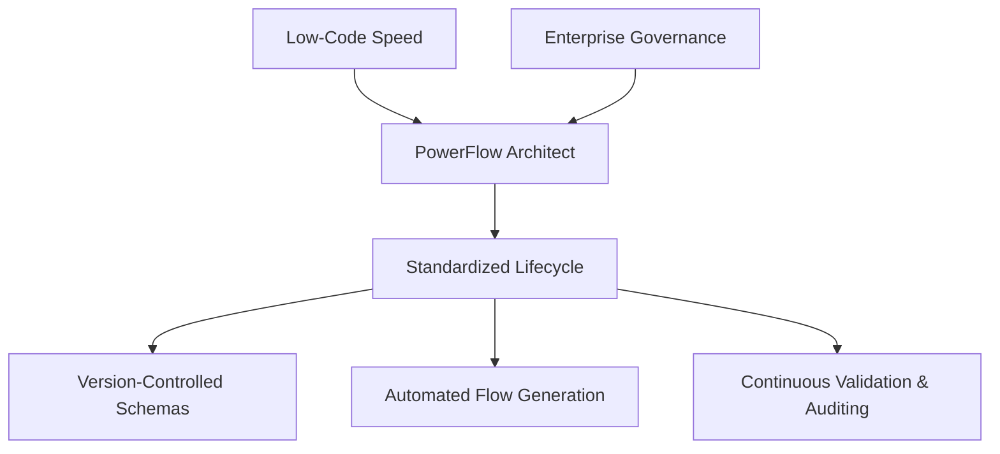

# Project Vision: PowerFlow Architect

## 1. Purpose: Why This Project Exists

In modern enterprise ecosystems, low-code integration platforms like Microsoft Power Automate enable rapid application deployment. However, this accessibility introduces severe governance, consistency, and maintenance challenges when scaled. 

**PowerFlow Architect** exists to bridge the gap between enterprise software engineering practices (version control, static validation, schema-driven generation) and low-code cloud runtimes. By treating Power Automate flow configurations as structured metadata, the project introduces automation, reliability, and architectural guardrails to list-to-spreadsheet synchronization workflows.

## 2. Background: What Problems It Solves

### 2.1 The Multi-Flow Proliferation Problem
A single enterprise data entity (e.g. a SharePoint List tracking `SystemInventory`) typically requires four separate synchronization flows to sync with an Excel sheet (Add/Update Sync, Delete Row Handler, Scheduled Validation, and Full Rebuild). For 100 tables, this yields 400 distinct cloud flows. Configuring and updating these flows manually via the Microsoft Power Automate browser interface requires hundreds of engineering hours and introduces inevitable configuration drift.

### 2.2 Lack of Compile-Time Schema Verification
Standard Power Automate flows evaluate mappings at runtime. A change to a column type in SharePoint silently breaks the sync, leading to data corruption in the target Excel workbook. These errors are only discovered after sync failures occur. PowerFlow Architect solves this by running offline validation checks on mappings prior to deployment.

### 2.3 Absence of Session Standardization
MFA (Multi-Factor Authentication) and strict conditional access policies often block server-to-server API integrations. Developers are forced to choose between insecurely storing user credentials in configuration files or configuring complex Azure AD application permissions. PowerFlow Architect resolves this by using browser profile redirection to securely cache and reuse standard authenticated sessions.

---

## 3. Target Users: Who It Is For

PowerFlow Architect is designed for three main enterprise stakeholders:

### 3.1 Platform Engineers & Solutions Architects
* **Persona**: Responsible for governance and consistency across Microsoft 365 environments.
* **Usage**: Uses the tool to define standardized template schemas and audit the tenant against naming and state drift.

### 3.2 Backend & Automation Developers
* **Persona**: Engineers tasked with building synchronization pipelines between SharePoint Online lists and target Excel registers.
* **Usage**: Uses the mapping engine to compile flow definitions programmatically and validate solution structures.

### 3.3 Compliance & Audit Teams
* **Persona**: Oversight personnel verifying that enterprise data is reconciled regularly and that security rules (least-privilege Entra scopes) are enforced.
* **Usage**: Reviews inventory and discrepancy reports to ensure sync status matches compliance baselines.

---

## 4. Vision of Success: What It Accomplishes

Success for PowerFlow Architect is defined by the following metrics:

* **Zero-Drift Standard**: 100% of deployed integration flows in the environment match the configuration-defined naming templates and structure.
* **Hours to Seconds**: Compiling 400 flow definitions from scratch is reduced from 2 weeks of manual browser clicks to under 30 seconds of CLI compilation.
* **Continuous Integrity**: Pre-deployment validation flags 100% of schema incompatibilities (e.g. mapping a Choice field to a Number field without conversion) prior to writing Flow JSON.
* **Modular Codebase**: A clean separation of modules (`auth`, `sharepoint`, `excel`, `generators`, `validators`) where new platforms or target connectors can be added as plugins without altering core compilation logic.

---

## 5. Scope: In-Scope vs. Out-of-Scope

### 5.1 In-Scope (Mandatory Requirements)
* **WDL Generation**: Outputting standard Flow JSON files compatible with Power Platform import engines.
* **Metadata Extractors**: Reading columns, validation properties, and constraints from SharePoint and Excel.
* **Static Verification**: Checking connection limits, variable definitions, and syntax structures.
* **Plugin Architecture**: A hook-based extensibility framework in Python to register custom transformation steps.

### 5.2 Out-of-Scope (Future Enhancements or Excluded Boundaries)
* **Direct Cloud Flow Hosting**: Executing flows inside the local Python runtime. (Flows must run on Microsoft's cloud infrastructure).
* **Live Database Connectors**: Syncing relational database tables (e.g. SQL Server, PostgreSQL) directly (handled by custom plugins or downstream cloud flows).
* **No-Code Web UI Builder**: Drag-and-drop workspace designers (configuration remains strictly file-driven).

---

## 6. Assumptions & Constraints

### 6.1 Assumptions
* **Tenant API Permissions**: Administrators grant client applications delegated access permissions to interact with Graph APIs.
* **Shared Storage State**: Playwright profiles can remain active for the duration of batch updates without administrative session revocations.

### 6.2 Constraints
* **Microsoft Flow Limits**: Flows must comply with execution boundaries (e.g., nesting limit of 8 loops, action count limits under 500).
* **Python Footprint**: Implementation is restricted to standard Python 3.10+ environments with no dependency on native compiled binaries beyond Playwright core drivers.

## 7. Open Questions

1. **Solution Export Format**: Do we export raw WDL JSON definitions or pre-packaged Power Platform Solution ZIP files? (Currently generating raw JSON definitions, packaging is flagged for future enhancements).
2. **Telemetry Standardization**: How should generated flows report run status to central monitors (e.g. Azure Application Insights vs SharePoint standard log tables)? (Currently left to custom template injection rules).
