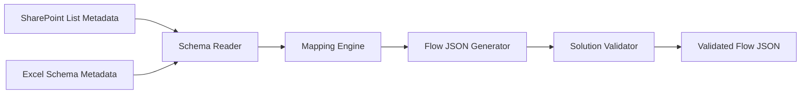
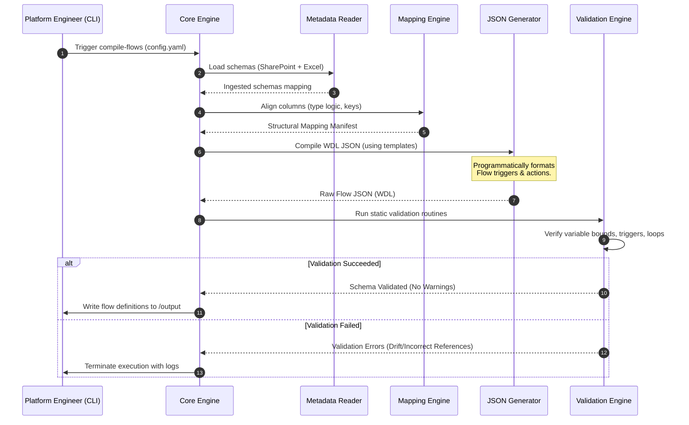

# Software Requirements Specification: PowerFlow Architect

## 1. Purpose

The purpose of this document is to specify the functional and non-functional requirements for the **PowerFlow Architect** framework. PowerFlow Architect is an enterprise-grade utility written in Python, designed to programmatically generate, validate, and manage Microsoft Power Automate flow definitions. The tool reads metadata from SharePoint Online lists and Microsoft Excel workbooks, establishes alignment mappings, generates deployment-ready Flow JSON definitions, and validates solutions prior to deployment to ensure enterprise compliance and system integrity.

## 2. Scope

### 2.1 In-Scope
* **SharePoint Metadata Reader**: Read site columns, field types, validation rules, and schema definitions from live SharePoint lists or schema definitions.
* **Excel Metadata Reader**: Inspect Excel workbook schemas, sheet tables, primary key structures, and data validation rules.
* **Mapping Engine**: Generate configuration-driven mappings between SharePoint fields and Excel columns, handling data type conversions.
* **JSON Flow Definition Generator**: Programmatically construct valid Microsoft Power Automate flow definition JSON (Workflow Definition Language schema) using modular templates.
* **Solution Validator**: Perform static analysis on generated flows to verify logic, loops, limits, triggers, and connection reference integrity.
* **Python Modular Architecture**: Clean packaging separating core translation logic from external integration components.
* **Plugin Extensibility**: An extensible plugin hook system enabling third-party developers to register custom mapping actions, validation rules, or template blocks.

### 2.2 Out-of-Scope
* **Active Deployment Operations**: Directly deploying solution ZIP packages into Power Platform environments (left to specialized CI/CD orchestration scripts or APIs).
* **Identity Provider Hosting**: Providing custom authentication directory services (uses standard Microsoft Entra ID).
* **Flow Running State Monitoring**: Real-time logging of individual runtime executions inside Power Platform (handled by Power Automate management connectors or telemetry exporters).

## 3. Background

Enterprises running workflows on SharePoint Online frequently require automated exports or backups to Excel tables for legacy ingestion, user-friendly reports, or data reconciliation. Currently, developers build these synchronization flows manually within the web interface. 

This manual method introduces several risks:
* **Human Error**: Typographical errors in JSON variables, incorrect field mappings, or missing loops.
* **High Maintenance Costs**: Upgrading 50 identical flows to include a new telemetry field requires editing each flow manually in the UI.
* **Lack of Validation**: Invalid API references or incorrect expression functions are only caught during execution.

PowerFlow Architect addresses this by shifting flow creation left: defining mappings in code/configuration, running local validation rules, and exporting standard Flow JSON that can be packaged into Power Platform Solutions.



## 4. Functional Requirements

### 4.1 Metadata Ingestion
* **FR-1.1**: The system **shall** connect to SharePoint via Microsoft Graph API to extract list column definitions (Internal Name, Display Name, Type, Choices, Required flags).
* **FR-1.2**: The system **shall** read Excel table schemas, including column names, formats, and primary key definitions from local or cloud-hosted `.xlsx` files.
* **FR-1.3**: The system **shall** support offline metadata definitions (JSON/YAML mocks) to allow schema parsing without active tenant network connectivity.

### 4.2 Mapping Engine
* **FR-2.1**: The system **shall** generate mapping files that associate SharePoint list columns with Excel table columns.
* **FR-2.2**: The system **shall** support type compatibility verification (e.g., warning if mapping a SharePoint multi-select choice field to a standard Excel text field without a designated join character).
* **FR-2.3**: The system **shall** support custom transformation mappings (e.g., date-time formatting, lookup field resolution, default value fallbacks).

### 4.3 Flow JSON Generation
* **FR-3.1**: The system **shall** assemble Power Automate flow definitions conforming to the Microsoft Workflow Definition Language (WDL) schema.
* **FR-3.2**: The system **shall** support generating flow JSON for:
  * Sync Add & Update operations.
  * Delete row operations.
  * Scheduled bulk validation checks.
  * Manual lists sync.
* **FR-3.3**: The system **shall** output separate flow definition JSON files alongside connection reference dependency manifests (`connectionReferences`).

### 4.4 Solution Validation
* **FR-4.1**: The system **shall** run static analysis checks against generated flow JSON to ensure trigger compliance and API action completeness.
* **FR-4.2**: The system **shall** validate that all referenced variables and connection identifiers are declared in the flow metadata header.
* **FR-4.3**: The system **shall** enforce best-practice constraints (e.g., maximum action counts, pagination limits on read actions, default retry policies).

### 4.5 Plugin System
* **FR-5.1**: The system **shall** load dynamic python plugins registered under specific entry points (e.g., `powerflow.plugins.generators`, `powerflow.plugins.validators`).
* **FR-5.2**: Plugins **shall** have the capability to modify the generated WDL block logic before write-to-file operations occur.

---

## 5. Non-functional Requirements

### 5.1 Architecture & Implementation Language
* **NFR-5.1.1**: The system **shall** be implemented in Python 3.10+ to ensure cross-platform runtime capabilities.
* **NFR-5.1.2**: The codebase **shall** use a strictly modular package structure: dependencies must strictly follow Clean Architecture guidelines (inner domain rings must have no dependencies on external client libraries).

### 5.2 Performance & Scalability
* **NFR-5.2.1**: The flow generation engine **shall** generate mapping matrices and output Flow JSON for 100 lists in less than 15 seconds.
* **NFR-5.2.2**: Ingested remote schema data **shall** be cached locally to minimize redundant network roundtrips to the Microsoft tenant during generation.

### 5.3 Reliability & Quality
* **NFR-5.3.1**: Flow JSON output **shall** pass JSON schema validation.
* **NFR-5.3.2**: The generator **shall** enforce structured telemetry fields in all generated flows, ensuring all actions write output to diagnostic blocks.

---

## 6. Assumptions

* **Microsoft Schema Stability**: Microsoft WDL schemas and Power Automate flow import formats remain stable and backward compatible for standard actions.
* **Client App Authorization**: The host environment executing PowerFlow Architect is registered in Entra ID with correct Graph permissions (`Directory.Read.All`, `Sites.Read.All`, `Files.ReadWrite.All`).

## 7. Constraints

* **WDL Size Limits**: Power Automate flows cannot exceed Microsoft limits on JSON file size (typically under 29MB) or total workflow action count (maximum 500 actions per flow).
* **Excel Metadata Access**: Cloud-hosted Excel workbooks must be registered inside active SharePoint document libraries or OneDrive drives accessible via Graph API.

## 8. Architecture

PowerFlow Architect is built as a modular CLI and utility library. 

```
               +-------------------------------------------------+
               |              Command Line Interface             |
               +-------------------------------------------------+
                                        |
                                        v
               +-------------------------------------------------+
               |           Core Engine (Python Core)             |
               |                                                 |
               |  +-------------------+   +-------------------+  |
               |  |  Schema Registry  |   |   Mapping Rules   |  |
               |  +-------------------+   +-------------------+  |
               +-------------------------------------------------+
                        |                           |
                        v                           v
     +--------------------+                       +--------------------+
     |   Plugin Loader    |                       | Validation Engine  |
     |                    |                       |                    |
     | +----------------+ |                       | +----------------+ |
     | | Custom Step    | |                       | | WDL Checkers   | |
     | +----------------+ |                       | +----------------+ |
     +--------------------+                       +--------------------+
```

## 9. Components

### 9.1 [auth](../src/auth)
* **Responsibility**: Authenticates with Entra ID to fetch Graph API tokens. Provides session handlers for SharePoint and Excel interfaces.

### 9.2 [sharepoint](../src/sharepoint)
* **Responsibility**: Houses logic to download and structure SharePoint list column properties and relationships.

### 9.3 [excel](../src/excel)
* **Responsibility**: Reads sheet table structures, verifying headers and key identifiers.

### 9.4 [generators](../src/generators)
* **Responsibility**: Maps column metadata types to Flow JSON properties. Compiles final WDL definition objects.

### 9.5 [validators](../src/validators)
* **Responsibility**: Validates that generated flow files match Microsoft schema parameters and respect retry policies.

### 9.6 [utils](../src/utils)
* **Responsibility**: Core logging, YAML configuration parser, and custom mapping cache managers.

---

## 10. Data Flow

The following sequence details how the system ingests data, maps fields, compiles Flow JSON, and validates the result.



---

## 11. Error Handling

* **Missing Key Fields**: If the mapping parser detects a missing primary key mapping, it must raise a `MissingMappingKeyError` and halt generation.
* **Incompatible Field Types**: When mapping a complex field (e.g., SharePoint Person/Group) to a simple string field in Excel, the mapping engine **shall** log a type mapping warning but proceed with generation using string formatting rules.
* **WDL Schema Violation**: Flows failing JSON schema verification **shall** write error logs displaying the exact line and property path containing the failure.

## 12. Security Considerations

* **Secrets Exposure prevention**: Standard templates **shall not** contain hardcoded secrets, connection keys, or credentials. All variable inputs must be references to environment connection resources.
* **Injection Validation**: The validator engine **shall** inspect generated expressions to prevent custom function injections or malicious code executions during runtime evaluation.

## 13. Configuration

Below is the requirements mapping structure for generating flows.

```yaml
project:
  name: PowerFlow Architect
  environment: Production
mapping_rules:
  - source_list: LIST_SystemInventory
    target_excel: "/drives/inventory/SystemInventory.xlsx"
    primary_key: ID
    columns:
      - source: Title
        target: SystemName
        type: String
      - source: Created
        target: CreationDate
        type: DateTime
```

## 14. Testing Considerations

### 14.1 Unit Testing Mappings
* Code testing **shall** verify that mapping logic translates custom types (Choice, Date, Number) correctly to Excel format strings.
* Validation rules must be tested against intentional schema mistakes (e.g., circular references, unbound variables) to confirm they reject broken flows.

### 14.2 Schema Validation
* System tests **shall** compare generated JSON files against official Microsoft Workflow schema validation definitions.

## 15. Future Enhancements

* **Direct Power Platform Solution Exporter**: Package output flow JSONs, connection manifests, and environment variables directly into a standard Solution `.zip` package.
* **Interactive UI mapping builder**: Web interface allowing non-developers to configure SharePoint list mapping coordinates visually.

## 16. Open Questions

1. **Solution Packaging Format**: Should the generator compile individual flows or package them into a single Power Platform Solution archive?
2. **Microsoft Graph API vs Native Power Automate Connector**: For querying schemas, do we default to direct Graph Client authentication or do we depend on connection references configured in the tenant?
