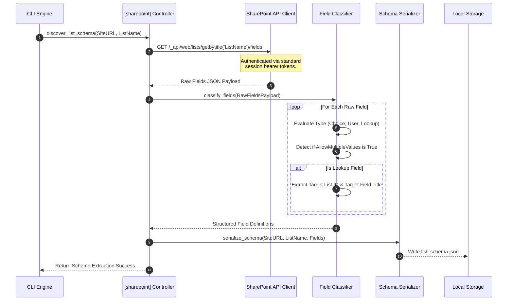
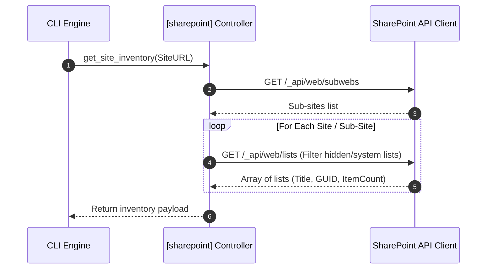

# SharePoint Explorer Architecture Specification: PowerFlow Architect

## 1. Purpose

The purpose of the **SharePoint Explorer Module** is to programmatically discover, inspect, and extract metadata definitions from Microsoft SharePoint Online site collections and lists. This module forms the foundation of the schema ingestion process in PowerFlow Architect, translating remote SharePoint configurations into structured local schema catalogs. These catalogs are subsequently consumed by the Excel Mapping Engine and the Power Automate Flow JSON Generator.

## 2. Scope

### 2.1 In-Scope
* **Site and List Discovery**: Enumerate site collections, sub-sites, document libraries, and custom lists within the target Microsoft tenant.
* **Field Inspection & Type Classification**: Inspect list schema columns to identify field types (Text, Note, Number, Choice, Date, Boolean, User, Lookup).
* **Relationship & Multi-Value Detection**: Identify columns configured with multi-value flags (e.g., multi-choice or multi-user) and extract reference attributes from Lookup columns (target lists, display fields).
* **Metadata Export Engine**: Export structured schema definitions into standardized local JSON/YAML file formats for offline operations.

### 2.2 Out-of-Scope
* **List Content Sync**: Direct transfer of actual list records/items (this module focuses exclusively on structural metadata definitions, not transaction records).
* **SharePoint List Creation/Provisioning**: Modifying or creating SharePoint lists, columns, or views on the server (read-only operations).

## 3. Background

Power Automate flows require precise references to SharePoint list columns, data types, and logical relations to prevent runtime action errors. Reading these attributes manually from the SharePoint site settings is slow and error-prone. 

SharePoint Online represents fields in raw, verbose API structures (e.g., SP.FieldChoice, SP.FieldLookup). The SharePoint Explorer abstracts this complexity by querying Graph or SharePoint REST endpoints, parsing the response payload, and packaging it into a developer-friendly representation. This representation maps choices, properties, and constraints, decoupling downstream flow generation from SharePoint-specific API anomalies.

---

## 4. Functional Requirements

### 4.1 Discovery & Enumeration
* **FR-1.1 (Site Enumeration)**: The system **shall** resolve target site collections by absolute URL or list available sub-sites under a root tenant domain.
* **FR-1.2 (List Enumeration)**: The system **shall** fetch all lists and document libraries within a site, returning GUIDs, display names, internal system names, and item counts.

### 4.2 Field Parsing & Classification
* **FR-2.1 (Field Type Resolution)**: The system **shall** map raw SharePoint field types to standardized types:
  * `SP.FieldText` / `Note` -> `String`
  * `SP.FieldChoice` -> `Choice`
  * `SP.FieldDateTime` -> `DateTime`
  * `SP.FieldNumber` / `Currency` -> `Number`
  * `SP.FieldUser` -> `User`
  * `SP.FieldLookup` -> `Lookup`
* **FR-2.2 (Multi-Value Check)**: The system **shall** check field properties (such as `AllowMultipleValues`) to flag field definitions as array collections.
* **FR-2.3 (Lookup Resolution)**: For lookup fields, the system **shall** retrieve target list identifiers (`LookupList` GUID) and lookup display fields (`LookupField` name).

### 4.3 Metadata Exporter
* **FR-3.1**: The system **shall** serialize structural list definitions to structured files.
* **FR-3.2**: Exported schema objects **shall** include list title, site URL, column mappings, choice arrays, and mandatory validation attributes.

---

## 5. Non-functional Requirements

### 5.1 Clean Separation of Concerns
* The SharePoint client module **shall** be standalone, receiving authentication credentials via authorization headers from the `auth` module interface without depending on its internal browser automation logic.

### 5.2 Performance & Cache Management
* To avoid hitting SharePoint API thresholds during multi-list compilation, list metadata **shall** support write-caching to local JSON databases.
* API calls **shall** request only relevant fields using `$select` query filters to limit network payloads.

---

## 6. Assumptions

* **Read Permissions**: The authenticated session context possesses at least read-only privileges (`Web.Read` / `Sites.Read.All`) over target site collections.
* **List Schema Availability**: SharePoint list columns have not been locked or hidden via complex tenant administrative configurations that prevent programmatic discovery.

## 7. Constraints

* **Graph vs REST Divergence**: Certain metadata properties (e.g., details on calculated columns or complex lookup associations) are only exposed via the SharePoint REST API v1.0, not the Microsoft Graph API. The explorer must handle both endpoints or abstract the variance.
* **Metadata Schema Payload Limits**: Sites containing high amounts of columns (e.g., >300 site columns) might yield large JSON payloads; the parser must parse these streams iteratively to avoid high memory spikes.

---

## 8. Architecture

The SharePoint Explorer leverages the client layer to execute Graph or REST queries, parsing the results through a Domain Engine into schema-compliant export objects.

```
+-----------------------------------------------------------------------------------+
|                                Command Line / Main                                |
+-----------------------------------------------------------------------------------+
                                         |
                                         v
+-----------------------------------------------------------------------------------+
|                        [sharepoint] Public Controller                             |
+-----------------------------------------------------------------------------------+
                                         |
              +--------------------------+--------------------------+
              |                                                     |
              v                                                     v
+------------------------------------------+ +--------------------------------------+
|            Discovery Service             | |            Field Classifier          |
|  - Site Enumerator                       | |  - Type Parser (Lookup, Choice)      |
|  - List Metadata Collector               | |  - Multi-Value Detector              |
+------------------------------------------+ +--------------------------------------+
              |                                                     |
              +--------------------------+--------------------------+
                                         |
                                         v
+-----------------------------------------------------------------------------------+
|                               Schema Exporter                                     |
|                      - Generates Local Schema Manifests                           |
+-----------------------------------------------------------------------------------+
```

## 9. Components

### 9.1 SharePoint Client Client (Infrastructure Interface)
* **Responsibility**: Houses transport-level logic. Sends HTTP requests to Graph and SharePoint endpoints.
* **Inputs**: Target URLs, site identifiers, and OAuth bearer tokens.

### 9.2 List Explorer Service (Application Layer)
* **Responsibility**: Orchestrates discovery sequences. Queries lists, filters systems lists (e.g., standard SharePoint hidden metadata lists), and maps GUIDs.

### 9.3 Field Classification Engine (Domain Layer)
* **Responsibility**: Evaluates the JSON representation of fields. Contains rules to evaluate field types and identify complex fields (Lookups and arrays).

### 9.4 Schema Serializer
* **Responsibility**: Formats parsed schema objects into standardized schema configurations for export.

---

## 10. Data Flow

### 10.1 Discovery and Schema Extraction Pipeline
This workflow describes how SharePoint Explorer discovers sites, lists, and columns to export metadata.



### 10.2 Site & List Inventory Query
This diagram outlines how sites and lists are enumerated to map available collections.



---

## 11. Error Handling

* **Access Denied**: If client queries return HTTP 403 (Forbidden), the explorer must stop the execution, log the target site URL and resource, and prompt the user to verify read permissions.
* **Malformed Custom Fields**: If a custom column definition uses non-standard extensions, the `Field Classifier` must assign a fallback type of `Unsupported` and log the raw field definition to the error directory without crashing the discovery process.
* **Throttling (HTTP 429)**: The network client must apply exponential backoff (starting at 2 seconds and doubling up to 5 attempts) when throttling headers are received.

## 12. Security Considerations

* **Export File Sanitation**: The exported schema files **shall not** contain raw document data, user records, or secrets. Only field layouts and metadata properties are written to disk.
* **Target Domain Validation**: To prevent server-side request forgery (SSRF), site URLs supplied to the client must match the authorized tenant host domains specified in the main configuration.

## 13. Configuration

```yaml
sharepoint_explorer:
  site_url: "https://tenant.sharepoint.com/sites/ProductionSite"
  cache_directory: "./cache/sharepoint/"
  excluded_lists:
    - "Master Page Gallery"
    - "Theme Gallery"
    - "LIB_SystemReference"
  api_version: "REST_V1"
```

## 14. Testing Considerations

### 14.1 Schema Extraction Mocks
* Test suites **shall** verify the `Field Classifier` using offline mock payloads containing choice fields, multi-value user arrays, and lookups to verify that type conversions match standard outputs.

### 14.2 Schema Drift Tests
* Integration tests **shall** compare previous exported schemas against fresh extracts, generating a diff highlighting added, removed, or type-changed columns.

## 15. Future Enhancements

* **Content Type Tree Resolver**: Expanding the discovery component to trace content types inheritance schemas across site collection content hubs.
* **Interactive List Selector**: A terminal interface allowing users to explore list structures visually and select target tables for mapping creation.

## 16. Open Questions

1. **Calculated Field Evaluation**: Should the compiler resolve calculation formulas, or are calculations ignored by the mapping engine? (Currently ignored, as calculations are executed server-side by SharePoint).
2. **REST API Depreciation Risk**: Since Microsoft recommends Graph API, what is the strategy for transitioning REST API calls (like complex Lookup lists metadata endpoints) if they are deprecated? (Currently mapped via abstract adapter layers, allowing easy endpoint swap).
