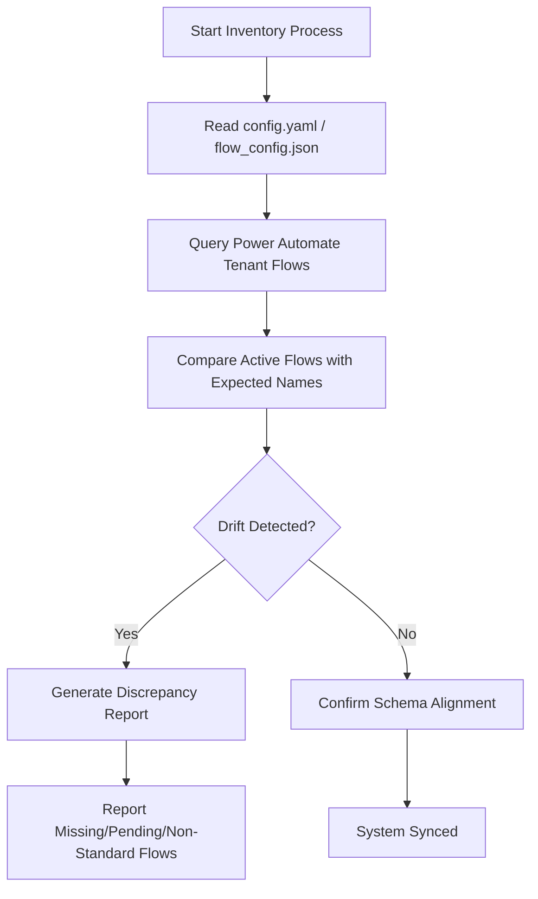
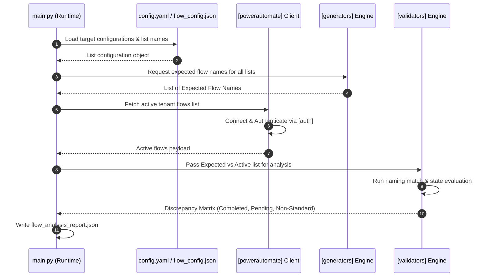
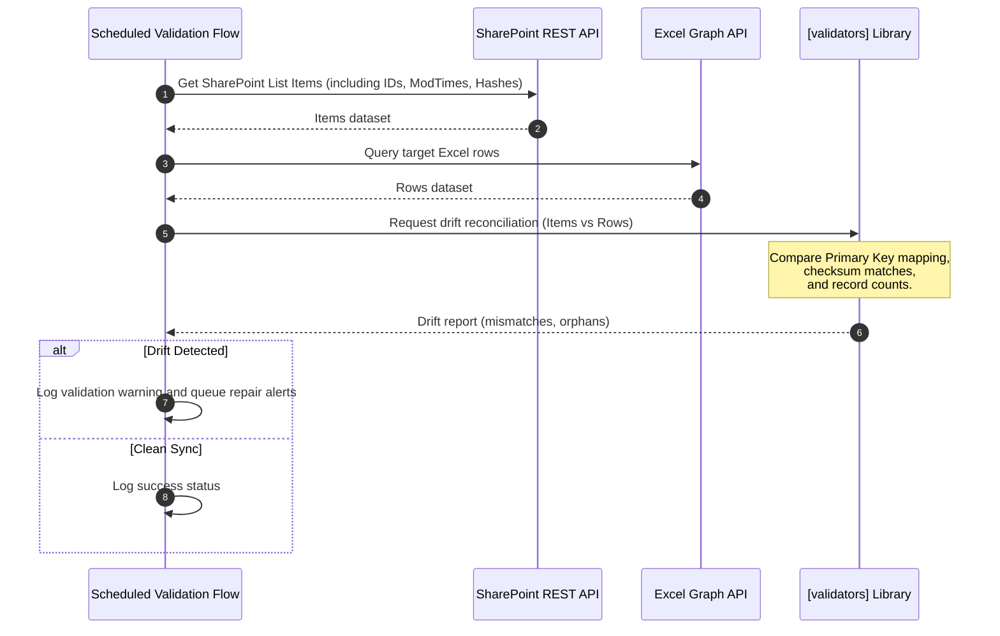

# System Architecture Specification: PowerFlow Architect

## 1. Purpose

The purpose of the **PowerFlow Architect** framework is to automate and standardize the lifecycle of Microsoft Power Automate flows that synchronize and validate data between Microsoft SharePoint Online lists and Microsoft Excel workbooks. At scale, manual creation, naming consistency checks, validation, and maintenance of synchronisation flows across hundreds of lists becomes operationally unsustainable. This system provides a programmatic approach to flow metadata definition, verification, validation, and architectural governance.

## 2. Scope

### 2.1 In-Scope
* **Metadata & Naming Generation**: Programmatic generation of standardized Power Automate flow display names based on a central configuration mapping SharePoint lists to pre-defined templates (e.g., Sync Add and Update, Scheduled Validation, Delete Excel Row).
* **Inventory & Discrepancy Reporting**: Analysis of active Power Automate flows in a tenant against expected configurations to identify missing, disabled, or non-standard flows.
* **Component-Based Architecture**: Separation of concerns into modules for Authentication, SharePoint metadata access, Excel operations, Power Automate APIs, template management, validation, and utility functions.
* **Data Reconciliation Specification**: Structural definitions of how scheduled validation flows reconcile SharePoint list items with corresponding Excel rows.

### 2.2 Out-of-Scope
* **Flow Execution Runtime**: The direct hosting or running of flow executions (which remain hosted inside the Microsoft Power Automate cloud service).
* **Direct UI Administration**: Hosting a graphical drag-and-drop workflow designer. All configuration is file-driven (YAML/JSON).

## 3. Background

Modern enterprise architectures frequently utilize SharePoint lists for lightweight data management and user input, while simultaneously requiring Excel spreadsheets for reporting, downstream legacy systems ingestion, or offline analysis. Power Automate is typically used to bridge this gap via triggered sync actions. 

However, enterprise ecosystems encounter the following problems:
1. **Flow Proliferation**: A single SharePoint list often requires up to four distinct flows (sync changes, handle deletions, perform validation, execute full rebuilds). Scaling to 100+ lists yields 400+ flows.
2. **Configuration Drift**: Manual modifications lead to drift in flow names, connections, and triggers.
3. **Data Inconsistency**: Network dropouts, API throttles, or manual edits in Excel cause silent sync failures, resulting in discrepancy between SharePoint and Excel.

PowerFlow Architect addresses these challenges by treating flow configurations as code, enabling automation of flow naming, structural consistency validation, and continuous auditing.

## 4. Functional Requirements

### 4.1 Configuration Management
* The system **shall** load list metadata, template definitions, and target environments from a central configuration schema (JSON/YAML).
* The configuration **shall** support excluding specific lists (e.g., library lists prefixed with `LIB_` or lists marked as already created).

### 4.2 Flow Name Generation
* The system **shall** generate consistent, template-based flow names for the following operational categories:
  * **Delete Excel Row**: Triggered when a SharePoint item is deleted to prune Excel.
  * **Manual Full Rebuild**: Runs on-demand to clear the target Excel file and rebuild it from the active SharePoint list.
  * **Scheduled Validation**: Runs daily/weekly to compare SharePoint item counts and schemas with Excel, flagging mismatches.
  * **Sync Add and Update**: Real-time sync of SharePoint modifications to Excel.
  * **Excel Export**: Exports data structures to static Excel spreadsheets.

### 4.3 Environment Inventory Analysis
* The system **shall** query the Power Automate API (or ingest exported run metadata) to catalog all existing flows.
* The system **shall** compare active flows in the Microsoft tenant against the generated expected flow names.
* The system **shall** output a discrepancy report identifying:
  * **Completed**: Active expected flows matching the templates.
  * **Pending/Missing**: Expected flows not yet deployed in the environment.
  * **Non-Standard**: Active flows in the environment that do not follow standard patterns or naming conventions.

### 4.4 Reconciliation & Validation Engine
* The system **shall** provide structural validator classes to compare SharePoint list contents (using item counts, primary keys, or hashes of specific columns) with Excel workbooks, reporting drift.



## 5. Non-functional Requirements

### 5.1 Modularity & Low Coupling
* The framework **shall** adhere to Clean Architecture principles. Business rules (validators, template formatting) must not depend on external API client implementations (SharePoint client, Power Automate client).
* Dependencies **shall** point inward toward core business abstractions.

### 5.2 Performance & Rate Limiting
* Network interactions with SharePoint and Power Automate APIs **shall** respect Microsoft Graph and SharePoint Online rate limits (e.g., implementing exponential backoff).
* The inventory parser **shall** optimize pagination when fetching lists or flows (e.g., using bulk operations and asynchronous pagination).

### 5.3 Extensibility
* The code **shall** allow adding new flow templates (e.g., Teams Notification flows or PDF archiving flows) by modifying the central configuration without changing core parsing logic.

### 5.4 Testability
* All logic classes **shall** support dependency injection to allow unit testing with mock API responses (preventing integration tests from hitting real tenant resources).

## 6. Assumptions

* **Office 365 Licensing**: The execution environment has the appropriate licenses (Power Automate per-flow or per-user plans) to run the generated flows without licensing warnings.
* **Service Account Access**: A dedicated service account (or App Registration) with permissions to read list schemas from SharePoint and query environment-level flows exists and is configured.
* **Primary Key Availability**: Every SharePoint list managed by the system contains a unique identifier (or fallback to the default SharePoint `ID` field) that maps directly to a corresponding primary key column in the Excel workbook.

## 7. Constraints

* **API Throttling Limits**: The Power Automate Management API enforces limits on requests per user. The ingestion tool must run within these limits.
* **Excel File Locking**: Excel workbooks stored in SharePoint/OneDrive are subject to file locks when opened by users. Synchronization flows must handle locking/retry limitations.
* **Maximum Flow Name Length**: Microsoft Power Automate limits flow names to 256 characters. Generated names exceeding this limit must be truncated gracefully while retaining uniqueness.

## 8. Architecture

PowerFlow Architect is organized around clean design rings. The dependency direction flows from outer infrastructure layers (databases, APIs, filesystem) toward inner core business rules.

```
+-------------------------------------------------------------------+
|                           Infrastructure                          |
|    [auth]              [sharepoint]              [powerautomate]  |
|      +                       +                          +         |
|      |                       |                          |         |
|      v                       v                          v         |
+-------------------------------------------------------------------+
|                            Application                            |
|             [excel]                    [generators]               |
|                +                            +                     |
|                |                            |                     |
|                v                            v                     |
+-------------------------------------------------------------------+
|                               Core                                |
|             [templates]                [validators]               |
|                               +                                   |
|                               |                                   |
|                               v                                   |
|                            [utils]                                |
+-------------------------------------------------------------------+
```

## 9. Components

The system is decomposed into the following modular packages located in the `src/` directory:

### 9.1 [auth](../src/auth)
* **Responsibility**: Manages security credentials, token acquisition, and session lifetimes.
* **Details**: Encapsulates Microsoft Authentication Library (MSAL) workflows. Obtains OAuth2 bearer tokens for Microsoft Graph, SharePoint REST API, and Power Automate Management services.

### 9.2 [sharepoint](../src/sharepoint)
* **Responsibility**: Interacts with the SharePoint REST API / Microsoft Graph API.
* **Details**: Retrieves site metadata, lists, list items, site columns, and list schemas. Provides abstract data structures representing lists.

### 9.3 [excel](../src/excel)
* **Responsibility**: Models and reads/writes Excel workbooks.
* **Details**: Handles Excel table manipulation, schema matching, row count tracking, and identification of key fields. 

### 9.4 [powerautomate](../src/powerautomate)
* **Responsibility**: Interacts with Power Automate management endpoints.
* **Details**: Ingests flow catalogs, retrieves run history, monitors flow states (Started, Stopped), and queries environment configurations.

### 9.5 [generators](../src/generators)
* **Responsibility**: Core name generation and template application logic.
* **Details**: Generates JSON and text assets containing expected flows based on schemas. Combines template definitions with list metadata to produce deterministic naming patterns.

### 9.6 [validators](../src/validators)
* **Responsibility**: Data consistency validation rules.
* **Details**: Houses the domain rules for validation. Compares records between SharePoint lists and Excel tables, identifies missing records, duplicates, or schema drifts, and calculates data hashes.

### 9.7 [templates](../src/templates)
* **Responsibility**: Manages workflow schemas and template definitions.
* **Details**: Stores JSON-based template structures for Power Automate flow definitions, allowing programmatically mapping variables to flow configurations.

### 9.8 [utils](../src/utils)
* **Responsibility**: System-wide shared utility modules.
* **Details**: Provides file configuration loaders, custom logging facilities, telemetry adapters, and error formatting helper functions.

---

## 10. Data Flow

### 10.1 Flow Validation & Drift Analysis
This scenario illustrates how the system pulls remote inventory and compares it to config-defined expected flows to report naming and presence drift.



### 10.2 Scheduled Sync Verification
This sequence shows the runtime data flow during a Scheduled Validation flow comparing actual data consistency between SharePoint and Excel.



---

## 11. Error Handling

* **API Failures**: Clients in `sharepoint` and `powerautomate` must handle HTTP status codes 429 (Too Many Requests) and 503 (Service Unavailable) using progressive exponential retry policies.
* **Drift Mitigation**: In cases of schema drift where expected Excel columns are missing, validation engines must abort the comparison and write structural error logs rather than attempting key lookups.
* **Transient File Locks**: If the target Excel sheet is locked, Excel connector operations must retry with a configurable delay (defaulting to 3 attempts with 30 seconds interval) before throwing a non-blocking execution warning.

## 12. Security Considerations

* **Credential Management**: Secrets, Client IDs, Client Secrets, and tenant details **shall not** be hardcoded. They must be retrieved from environment variables or secured via credential stores (e.g., Azure Key Vault or macOS Keychain).
* **Least Privilege**: The system's API credentials **shall** be restricted to the minimum required scopes:
  * SharePoint API: `Sites.Read.All` (or restricted via Sites.Selected).
  * Power Automate: `Flows.Read.All` (for read-only audits) or environment level administration permissions only when deploying.
  * Excel: `Files.ReadWrite` (scoped strictly to target folders containing the sync assets).
* **Audit Logs**: Flow analysis executions must generate detailed execution audits with session correlation IDs, ensuring trace histories of all modified names.

## 13. Configuration

The framework parses a schema structure mapped via `flow_config.json`. Below is the architectural specification of the configuration properties:

### 13.1 Key Schema Structure
* `lists`: Array of target SharePoint List titles to parse.
* `already_created_lists`: Map of lists that have been configured in previous epochs and should be skipped for new generations.
* `flow_templates`: Dictionary specifying templates:
  * `name`: Descriptive name of the flow template.
  * `template`: String template supporting placeholder insertion (e.g., `"{list} - Scheduled Validation"`).
  * `enabled`: Boolean flag indicating if the system should expect/generate flows of this category.
* `output`: Defines paths and files where report lists are saved.

### 13.2 Schema Validation Example
```yaml
lists:
  - LIST_SystemInventory
  - LIST_FrameworkRequirements
flow_templates:
  delete:
    name: "Delete Excel Row"
    template: "{list} - Delete Excel Row"
    enabled: true
output:
  base_directory: "./generated_flows/"
  files:
    by_category: "flows_by_category.json"
    by_list: "flows_by_list.json"
```

## 14. Testing Considerations

### 14.1 Mocking Strategy
The structure separates client calls from evaluation logic:
* Unit tests **shall** run offline by supplying mock JSON representations of SharePoint lists and Power Automate flows directly to the `validators` and `generators` classes.
* Data sets like `list_my_flows_output.json` are maintained in test folders to check engine parsing code robustness.

### 14.2 Schema Verification Tests
Integration tests **shall** verify that generated Excel sheets align with list schemas, ensuring column type mappings (e.g., converting SharePoint Choice columns to Excel validation dropdowns) match expectations.

## 15. Future Enhancements

* **Auto-Deployment Engine**: Extending the `powerautomate` module to automatically deploy and configure Power Automate ZIP packages to target environment solutions using standard connection references.
* **Interactive CLI Dashboard**: Command-line visualizer displaying sync indicators, drift rates, and validation reports directly to platform engineers.
* **Bi-directional Sync Validation**: Real-time validation that monitors edits made directly to Excel and syncs them back to SharePoint.

## 16. Open Questions

1. **Flow Trigger Strategy**: Do we prefer polling triggers (e.g., recurrence checks) or webhook event-driven triggers (SharePoint "When an item is created or modified") for real-time synchronization? Event-driven triggers are real-time but can experience delays under heavy list loads.
2. **Environment Isolation**: How are connection references managed across Development, UAT, and Production environments without manual updates during deployment? (Assumed to be resolved via Power Platform Environment Variables, but requires documentation in deployment playbooks).
