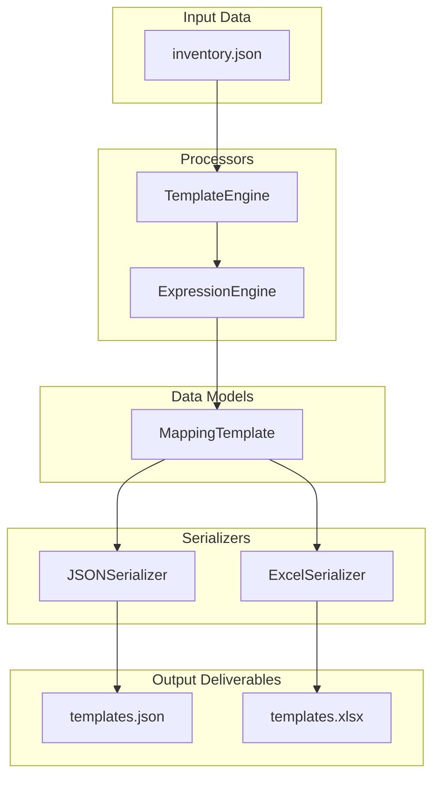

# Template Engine Architecture Documentation

This document describes the design, data structures, and serializations of the Template Engine module introduced in Sprint 4.

## Objective
The Template Engine is responsible for compiling field-level Power Automate expressions into structured Value Objects representing the complete mapping configuration required by Excel Online actions ("Add a row into a table" and "Update a row"). 

## Key Architecture & Design Choices



### 1. Column Display Name Mapping Keys
When Power Automate writes a row to an Excel Table via "Add a row into a table", the action parameters map **Excel Column Headers** to their respective value inputs. Because the Excel column headers are established using the **Display Names** of the SharePoint columns, the Template Engine generates Value Objects mapping field display names directly to their expressions:
```json
{
  "Display Name": "Generated Expression"
}
```
This is a critical architectural distinction from the expression generator's default output (`expressions.json`), which uses the **Internal Field Names** as keys.

### 2. Validation and Column Filtering
To prevent malformed spreadsheet columns or failures in mapping read-only parameters:
- **System columns** (e.g. `ID`, `Created`, `Modified`, `Author`, `Editor`) are excluded because they are managed automatically by SharePoint and cannot be written to or modified during sync.
- **Title** is explicitly preserved since it is the primary column and user-writable.
- **Unsupported fields** (classified as `UNKNOWN`) are excluded from the mapping.

### 3. Styled Excel Deliverable
`templates.xlsx` formats mapping tables to make them developer-friendly for copy-pasting:
- **Column A**: `Excel Column Header` (Display Name)
- **Column B**: `Power Automate Expression` (ready to select and copy directly)
- Worksheets are named after lists and styled with visible gridlines, Segoe UI typography, striping, and auto-adjusted margins.

---

## Deliverable File Formats

### 1. `templates.json` Structure
```json
{
  "REG_InformationSystems": {
    "Title": "@items('Apply_to_each_1')?['Title']",
    "Description": "@items('Apply_to_each_1')?['Description1']",
    "Scope": "@items('Apply_to_each_1')?['Scope/Value']"
  }
}
```

### 2. `templates.xlsx` Structure
One tab per list, with columns:
| Excel Column Header | Power Automate Expression |
| :--- | :--- |
| Title | `@items('Apply_to_each_1')?['Title']` |
| Description | `@items('Apply_to_each_1')?['Description1']` |
| Scope | `@items('Apply_to_each_1')?['Scope/Value']` |
